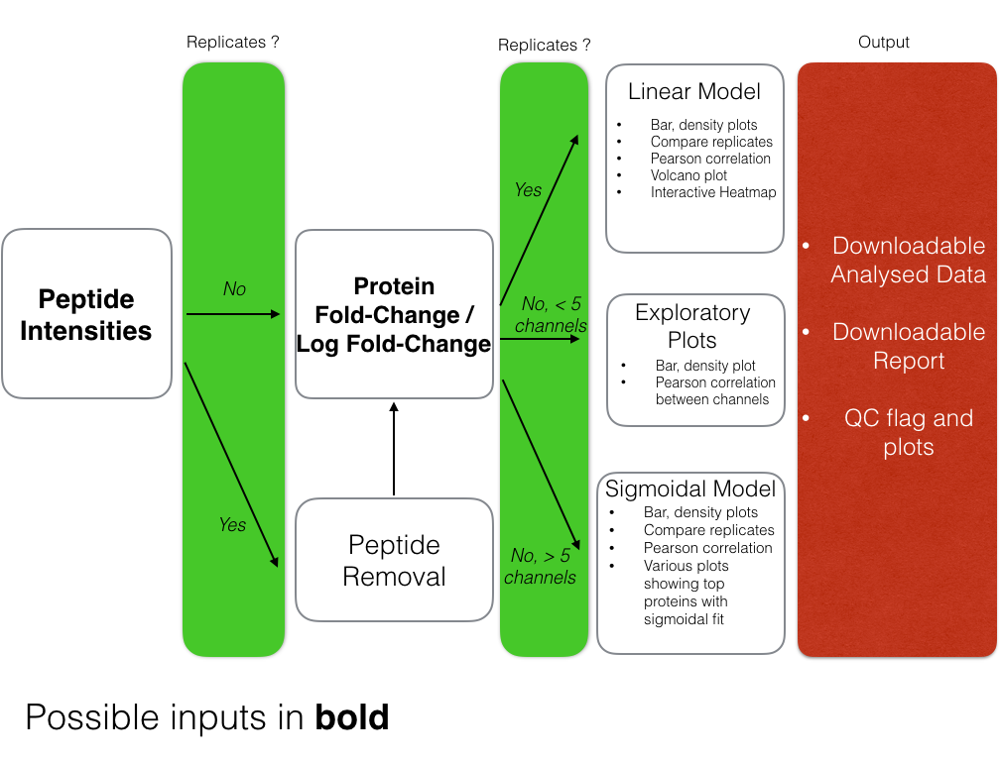
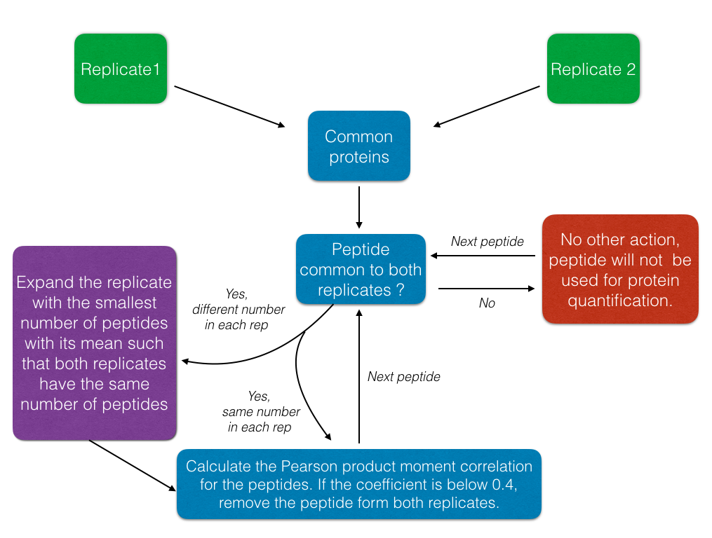

## Introduction 

DOSCHEDA is a Shiny web application which analyses chemo-proteomics Mass Spectrometry data. It is designed to be used by biologists such that they can analyse their data immediately, giving a series of plots aimed to visualise the quality of the data as well as the 'most important' results from it. The application has a series of different pipelines which will be applicable to different experimental designs. A novel aspect of DOSCHEDA is a peptide removal process aimed to reduce noise in the data, given that the data supplied is peptide intensities. This is process will be explained in detail within the manual. The application will also, given the user has enough data, allow the application of linear and sigmoidal models. Detail of this can be seen in Figure 1. After uploading an experiment and running DOSCHEDA, the results can be downlaoded and saved as well as a HTML report which contains all of the relevant plots seen whilst DOSCHEDA is running. 
This manual will aim to give a general overview of the application, for specific, step-by-step instructions for a given experimental design please refer to the DOSCHEDA walkthroughs available at https://github.com/brunocontrino/DOSCHEDA . 



## The Data 

The application is designed to take three different types of data which can come out of the chemo-proteomic experiments:

**Peptide Intensities:** These consist of a series of peptide intensities which are attributed to each protein in the data set. In the most common technology, these peptides are summed to quantify the protein. These are then converted to log fold changes and then passed into the pipeline.

**Fold Changes:** These are the fold changes of the peptide intensities mentioned above. 

**Log Fold Changes:** These are the log fold changes of the peptide intensities mentioned above.

 This application has been optimised for using data from ProteomeDiscoverer 2.1 (PD 2.1), but it can also take data from other technologies given that it contains certain columns. Depending on which kind of data is selected there are different requirements These are seen in Table 1 and Table 2. 

```{r wastebin1, eval = FALSE,echo = FALSE}
*Peptide Intensities: `r c("Peptide Qvality Score", "Protein Accessions", "Peptide Names", "Intensities (several columns)")`*

*Fold Changes: `r c( "protein Fold Changes (several columns)")`*

*Log Fold Changes: `r c( "protein log-Fold Changes (several columns)")`*
```

|                    |Input                                                                                   |
|:-------------------|:---------------------------------------------------------------------------------------|
|**Peptide Intensities** |Peptide Qvality Score, Protein Accessions, Peptide Names, Intensities (several columns) |
|**Fold Changes**        |Protein Fold Changes (several columns)           |
|**Log-Fold Changes**    |protein log-Fold Changes (several columns)     |

Table: Table 1. Required inputs for DOSCHEDA if data is from PD2.1  


```{r westbin2,echo = FALSE, eval = FALSE}
*Peptide Intensities: `r c("Peptide Qvality Score", "Protein Accessions", "Peptide Names", "Intensities (several columns)")`*

*Fold Changes: `r c( "Protein Accessions", "protein Fold Changes (several columns)", "Gene id(optional)")`*

*Log Fold Changes: `r c( "Protein Accessions" ,"protein log-Fold Changes (several columns)", "Gene id (optional)")`*

```


|                    |Input                                                                                   |
|:-------------------|:---------------------------------------------------------------------------------------|
|**Peptide Intensities** |Peptide Qvality Score, Protein Accessions, Peptide Names, Intensities (several columns) |
|**Fold Changes**        |Protein Accessions, protein Fold Changes (several columns), Gene id(optional), Unique Peptides           |
|**Log-Fold Changes**    |Protein Accessions, protein log-Fold Changes (several columns), Gene id (optional), Unique Peptides      |

Table: Table 2. Required inputs for DOSCHEDA if data is not from PD2.1  

## Uploading your data

In order to use DOSCHEDA correctly it is key to learn how the **Data Upload** tab is used in order to upload your data, select the correct column headers and check that what you have entred is in fact what you want to analyse. In this section we give an overall guide on how to do this.

**Step 1**. Click on the **Upload Data** tab. 

**Step 2**. Choose your data type (intensities, Fold changes, Log Fold Changes)

**Step 3**. Choose your file type (csv,txt,xlsx)

**Step 4**. Click 'Browse' and select your file. Ensure the prior steps have been completed. 

**Step 5**. Once the file has loaded go to the drag and drop box and enter the correct columns which contain your intensities/fold changes/log fold changes. 

**Step 6**. Check that the columns you have select correspond to the correct standardised name by looking at the table in the top right corner.
+ If you are applying a sigmoidal model, select **Sigmoidal** from the **Fit model:** radio buttons and input your concentrations. They must not be in log form and the should be from lowest to highest, each separated by a comma.

**Step 7**. If your data is from PD2.1 click away from the 'Data Upload' tab and cycle through the rest of the tabs, when DOSCHEDA is busy, the word 'loading will appear in the top left corner of the app and once this stops the plots will be generated. If it not from PD2.1 you will need to enter the missing fields seen in Table 2 by ticking the appropriate checkboxes and selecting the correct column names for these fields.


To have a step by step guide on each different type of input and model type combination you can see the individual walkthroughs available at  which will give a detailed example of how to carry out each type of analysis successfully using the application.

### Other Uploadable Files

There are two other possible upload files that DOSCHEDA has a functionality for, a protein accession to gene symbol ID file and a list of Kinases to compare with the proteome in your data set. 

The protein accession to gene symbol ID file should only be used if you do not want DOSCHEDA to use the intermine gene ID and you want each accession to be converted to a custom set of gene ID. The intermine files will be updated regularly and therefore should be able to meet the needs of your experiment without the need to upload your own file.

The **Include file** check box visible in the Venn tab within the **Box and Density plots** tab will simply let you see if there is an intersection between your custom list of proteins and the kinases and proteins in your data. This is not crucial to the DOSCHEDA pipeline and should only be used if you have this specific requirement.


## Downloading your Results

Users can save their results by clicking on the 'Downloads' tab, clicking on the 'Download Data' button to download the processed data and clicking on the 'Download Report' button to download a HTML report containing all the plots seen in the analysis with descriptions as well as other important elements such as the options the user has inputted for example the number of channels, repicates and which fit they have applied to the data.


## Different Models 

We have the option to apply two different types of model to the data, linear and sigmoidal. The linear model uses a linear model fit with a quadratic formula such that we obtain a coefficient for the intercept, slope and quadratic of a parabola. This fit can be applied to experiments with few concentrations.  
However if there are enough channels, a sigmoidal fit can be applied. We use a model with 4 parameters which aims to model a dose response for the proteins for the drugs. 


|                     |1 Replicate |More than 1 Replicate |
|:--------------------|:-----------|:---------------------|
|**Less than 5 channels** |Not enough data      |Linear                |
|**5 or more channels**   |Sigmoidal   |Linear                |

Table: Table 3. Possible model application depending on experimental design.

As well as the model applied data there is also a difference in processing the data depending on the model we fit. In terms of the linear model there is not a lot of difference, we filter by the number of unique peptides, in the sigmoidal fit we change the data such that each protein is dose response where the score is a percentage present at the concentration. Due to the experiment, a lowering of percentage means the protein is binding more to the drug. 


## Linear Fit: Peptide Removal Process 

The peptide removal process uses a Pearson Moment Correlation coefficient in order to determine linearity between two of the same peptides that belong to the same protein accession. We assume that the same peptide has a linear relationship between each replicate at the different concentrations, this grounds our reasoning for using a Pearson Correlation to quantify the linear relationship between the replicates. 

The main steps of the peptide removal are as follows: 

**Step 1**. Match the proteins in both replicates, eliminate all other proteins.

**Step 2**.  Match the peptides within each of the matched proteins, eliminate all other proteins. 

**Step 3**. If there are discrepancies in the number of a particular peptide between the replicates, these are matched by taking the mean of the replicate with less counts of the peptide is taken and repeated such that there are the same number of peptides per replicate. The imputed values are only used in step 3 and are not considered in the final quantification of the protein. 

**Step 4**. Per peptide, calculate the Pearson correlation between each replicate and eliminate all peptides with a coefficient less that 0.4.

**Step 5**. Sum all intensities per protein accession to give a final intensity per protein with the noisy peptides removed. 


### Example of Step 3

We have created a dummy example to give more details on Step 3. 
We have two replicates: one with three of the same peptide (Table 4) and one with two of the same peptide (Table 5). This means that we need to match the two replicates such that they will have the same number of peptides. To do this we take the mean of each of the channels to expand the second replicate such that it has 3 peptides within it. This is seen on the third row of Table 6 which is the mean of the rest.   
The two tables are then used to calculate the Pearson moment correlation constant, if it is smaller than 0.4 the peptide will not be used to quantify the protein that the peptide A is associated to. 
  In this case the correlation constant is 0.5 therefore the peptide A will be used to quantify the protein it is associated with.  

|Peptide | Control_rep1| C0_rep1| C1_rep1| C2_rep1|
|:-------|------------:|-------:|-------:|-------:|
|A       |            1|       1|       1|       1|
|A       |            2|       2|       2|       2|
|A       |            3|       3|       3|       3|

Table 4: Example: Peptide values for replicate one 

|Peptide | Control_rep2| C0_rep2| C1_rep2| C2_rep2|
|:-------|------------:|-------:|-------:|-------:|
|A       |            1|       1|       1|       1|
|A       |            2|       2|       2|       2|

Table 5: Example: Peptide values for replicate two 

|Peptide | Control_rep2| C0_rep2| C1_rep2| C2_rep2|
|:-------|------------:|-------:|-------:|-------:|
|A       |            1|       1|       1|       1|
|A       |            2|       2|       2|       2|
|A       |            1.5|       1.5|       1.5|       1.5|

Table 6: Example:  New values for replicate two, with the third row being the mean of the columns. 




## Sigmoidal Fit: Parameters

The pipeline for analysing a data set with a sigmoidal fit is slightly different than in the linear model case. The data is not transformed to log2 as each channel is converted from fold-change to percentages.

DOSCHEDA will fit a sigmoidal with 4 parameters: The initial value, value, RB50 and the slope. 
The top and bottom are simply the starting point, that is how much of a protein is binding to the drug at the first concentration and at the last concentration of the data.

The RB50 is the concentration of the drug where the 50% of the protein has bound to the drug.

The slope parameter is for the slope of the sigmoidal curve in the case of residual binding experiments the slope coefficient is expected to be negative as we expect a decrease between the initial value and final value of each protein. 

If the data set contains a pull down of pull down column, the depletion factor *r* of the experiment can be calculated. This is then multiplied by the RB50 value in order to give the dissociation constant (K~d~) which is the equilibrium rate constant of the protein. 

The user can include this in the final downloadable data by ticking the **Include pulldown of pulldown** check box in the **Data Upload** tab which will allow you include this column and DOSCHEDA will give give the depletion factor *r* and the dissociation constant (K~d~) in the downloadable data. 

## The Plots

The plots that will be generated are designed to give an idea if the experiment has been successful and visualise how much the proteins which are binding to the drug at different concentrations.

|Plot                          |Description                                                                                                                                                          |Available               |Type     |
|:-----------------------------|:--------------------------------------------------------------------------------------------------------------------------------------------------------------------|:-----------------------|:--------|
|Box                           |A box plot showing the mean and the interquartile range of each normalised channel. For linear fits this is log2 normalised fold changes, for sigmoidal percentages.                                                                                              |Always                  |QC       |
|Density and ranked protein    |These plots show the density distribution of each channel and the distribution of the ranked proteins                                                                |Always                  |QC       |
|Venn                          |The intersection of the kinome and the inputted proteins. There is also the option to load a list of protein names and see the intersection with a personalised list |Always                  |QC       |
|MeanSD                        |Shows the ranked means with a running median calculated with a window size of 10%                                                                                         |Always                  |QC       |
|Mean vs Difference            |Shows us the mean protein fold change and difference between different replicates                                                                                    |At least 2 replicates   |QC       |
|Corrgram                      |Pearson Correlation Coefficient between each channel                                                                                                                 |Always                  |QC       |
|Compare Replicates            |The fold change per protein plotted against each other in each replicate                                                                                              |At least 2 replicates   |Analysis |
|PCA                           |Each channel is plotted in the first two principal components of the data                                                                                            |Always                  |Analysis |
|Heatmap                       |Interactive heatmap of the values per protein per channel                                                                                                            |Always                  |Analysis |
|Linear Model: P-values        |The distribution of p-values for each coefficient of the linear model, that is the intercept, slope and quadratic                                                     |Linear Model Applied    |Analysis |
|Linear Model: volcano plots   |The distribution of proteins by their mean and standard deviation coloured by their p-values, there is a plot for each coefficient in the linear model                |Linear Model Applied    |Analysis |
|Sigmoidal Model: Top - Bottom |The largest differences between the proteins from the lowest and highest concentrations                                                                               |Sigmoidal Model Applied |Analysis |
|Sigmoidal Model: RB50         |The top proteins with significant RB50 values                                                                                                                        |Sigmoidal Model Applied |Analysis |
|Sigmoidal Model: Slopepl      |The top proteins with significant Slope Value                                                                                                                                                                   |Sigmoidal Model Applied |Analysis |

## DOSCHEDA: Summary tab

The summary tab in the app will show a few quality controls and show a table of the most relevant values for each gene in the pipeline. The user can search this table with text matching. 

There are also boxes which, depending on your results, will either show a green box with a tick if your results meet some criteria and an orange warning box if the criteria are not met. 

|QC                 |Criteria                                                                                     |
|:------------------|:--------------------------------------------------------------------------------------------|
|Corrgram           |Corrgram: No channels are anti-correlated                                                    |
|Model Coefficients |The number of statistically significant coefficients are greater than 0 for each coefficient |


## Get DOSCHEDA

There are two different methods to use DOSCHEDA: 

1. Use a web link https://bruniec.shinyapps.io/doscheda/ , this requires no installation only access to the web and your data files are on the device you are accessing DOSCHEDA from.

1. Download the App from github at https://github.com/brunocontrino/DOSCHEDA 

Note:

For option 1, one can also host the app in their own server and have the app working within their own firewall with a link. 

For option 2 one must have R installed on their device as well as the packages that are present at the top of the app.R file seen in the github repository.


## Help and Troubleshooting

Please feel free to contact us at ... if there any questions or problems with DOSCHEDA, we will try to help as quickly as possible. 

Below are some solutions to some common issues. 

### Wrong file type selected for upload. 

If the user has selected the wrong file type by mistake, DOSCHEDA will show a series of errors in the 'Data Upload' section. To rectify this one must select a different file to upload (it is of no importance, but small files will upload faster),change the file type to the correct selection, then re-click on the 'Browse' button and select the required file. The application will now work as it should. 

### Error: variable lengths differ

If this error is present when applying a sigmoidal fit to the data, this means that DOSCHEDA is expecting a different amount of concentrations, please return to the **Data Upload** tab and ensure that this section has been filled in correctly, note that there will be a warning below the concentration input to tell the user if it is expecting more or less concentrations. 


